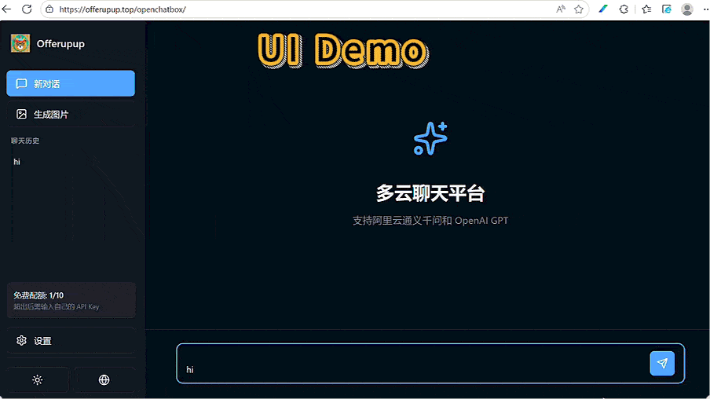

# 多云聊天平台 / Multi-Cloud Chat Platform

一个支持阿里云通义千问和 OpenAI GPT 的现代化聊天应用。

**✨ 纯 Python + 原生 HTML/JS，无需 npm，无需构建！**



## 功能特性 / Features

- 多云平台支持：阿里云通义千问（Qwen Plus/Turbo/Max/Long）、OpenAI GPT 系列（GPT-4/GPT-3.5）
- 聊天功能：实时对话、Markdown 渲染、多模型切换、聊天历史、Token 使用统计
- 图片生成：DALL-E 3（OpenAI）、通义万相（阿里云）
- 免费配额限制（无需API Key可体验，超限后需自填Key）
- 多语言支持：中文/English，动态切换
- 现代化UI：深色/浅色主题，响应式设计
- 零前端依赖：无需 Node.js、npm、React、Vite

## 项目结构 / Project Structure

```
openchatbox/
├── main.py            # FastAPI 后端主程序
├── requirements.txt   # Python依赖
├── .env               # 环境变量配置（API Key等）
├── Dockerfile         # Docker 构建文件
├── docker-compose.yml # Docker编排（推荐）
├── static/            # 前端静态资源
│   ├── index.html     # 主页面
│   ├── app.js         # 前端逻辑
│   ├── i18n.js        # 多语言
│   ├── style.css      # 样式
│   └── ...            # 其它资源
└── README.md
```

## 快速开始 / Quick Start

### 1. 本地运行（无需 Docker）

```sh
# 推荐使用虚拟环境
python -m venv venv
source venv/bin/activate  # Windows: venv\Scripts\activate

# 安装依赖
pip install -r requirements.txt

# 配置环境变量
cp .env.example .env   # 或手动创建 .env
# 编辑 .env，填入你的 API Key

# 启动服务
python main.py
# 默认运行在 http://localhost:8000
```

### 2. Docker 一键部署

```sh
# 构建镜像（如需自定义）
docker build -t openchatbox .

# 推荐使用 docker-compose
# 编辑 .env，填入你的 API Key
# 启动所有服务（含nginx反向代理）
docker-compose up -d

# 或单独运行主服务
# docker run --env-file .env -p 8000:8000 openchatbox
```

- 默认端口：8000
- 前端访问：http://你的服务器:8000 或 nginx 代理后的路径

### 3. API Key 配置

- 阿里云 DashScope：在 .env 设置 DASHSCOPE_API_KEY
- OpenAI：在 .env 设置 OPENAI_API_KEY
- 免费配额用完后，前端设置页可自填 Key

## API接口 / API Endpoints

- 获取模型列表：`GET /api/models`
- 聊天：`POST /api/chat`
- 图片生成：`POST /api/generate-image`
- 配额查询：`GET /api/usage`

## 生产部署建议

- 推荐使用 Docker + docker-compose
- 生产环境请配置 CORS 域名和 HTTPS
- 不要将 API Key 提交到 Git

## License

MIT
